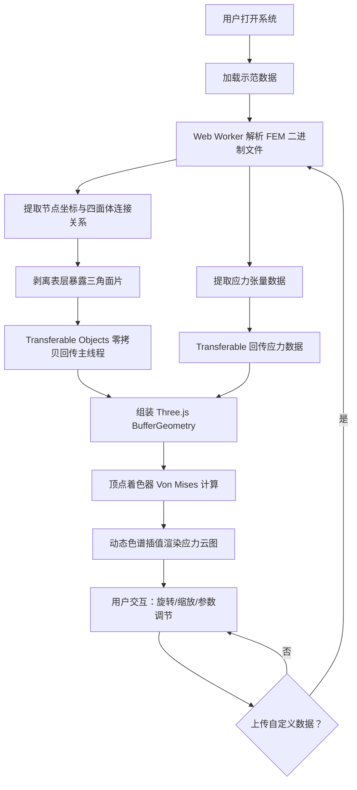

## 1. 产品概述

超高层建筑强风灾害防御 3D 可视化系统——面向土木工程灾害防御的前沿 Web 端仿真平台。在浏览器中纯渲染超高层建筑遭受强风侵袭时的结构应力响应，通过百万级四面体有限元网格的实时解析与 Von Mises 等效应力动态色谱云图，为工程人员提供直观的结构安全评估与预警能力。

- 目标用户：土木工程师、结构分析师、灾害防御研究人员
- 核心价值：将 ANSYS 等专业有限元软件的计算结果以交互式 3D 可视化方式在浏览器端呈现，消除对专业桌面软件的依赖，实现结构应力场的实时交互与灾害预警

## 2. 核心功能

### 2.1 功能模块

1. **3D 可视化主场景**：超高层建筑三维模型展示、应力云图渲染、相机交互控制
2. **FEM 网格解析引擎**：Web Worker 中解析 ANSYS 导出的二进制格式有限元网格文件，提取表层三角面片
3. **应力张量可视化**：Von Mises 等效应力计算与动态色谱插值渲染
4. **控制面板**：风场参数调节、应力阈值设置、渲染模式切换、时间步动画控制

### 2.2 页面详情

| 页面名称 | 模块名称 | 功能描述 |
|---------|---------|---------|
| 3D 可视化主页面 | 3D 场景视口 | 展示超高层建筑三维模型，支持轨道控制器旋转/缩放/平移，渲染应力云图 |
| 3D 可视化主页面 | 顶部状态栏 | 显示当前风场等级、最大 Von Mises 应力值、屈服预警状态、帧率 |
| 3D 可视化主页面 | 左侧控制面板 | 风速滑块、风向选择、应力色谱范围设置、渲染模式切换（实体/线框/实体+线框） |
| 3D 可视化主页面 | 右侧信息面板 | 当前悬停单元应力详情、节点坐标、应力张量6分量数值 |
| 3D 可视化主页面 | 底部时间轴 | 时间步动画控制，播放/暂停/步进，风场时程加载 |
| 3D 可视化主页面 | 数据加载区 | 支持拖拽上传 ANSYS 二进制 FEM 文件，显示解析进度 |

## 3. 核心流程

用户打开系统后，默认加载内置的超高层建筑示范数据（含预计算的强风应力场）。3D 场景自动渲染建筑模型与应力云图。用户可通过控制面板调节风场参数，观察应力场实时变化。用户也可上传自定义 ANSYS 导出文件，系统在 Web Worker 中解析后更新可视化。

## 4. 用户界面设计

### 4.1 设计风格

- **主色调**：深空黑（#0A0E1A）作为背景底色，科技蓝（#00D4FF）作为交互高亮色，危险红（#FF2D55）作为屈服预警色
- **辅助色**：应力色谱从深蓝（#00008B）→青（#00CED1）→绿（#00FF7F）→黄（#FFD700）→亮红（#FF0040）
- **字体**：标题使用 Orbitron（科技/工程感），正文使用 Source Sans 3（高可读性）
- **布局**：沉浸式全屏 3D 视口，浮动半透明毛玻璃面板
- **按钮风格**：圆角微光边框按钮，悬停时发光效果
- **图标风格**：线性 Lucide 图标，尺寸 16-20px

### 4.2 页面设计概览

| 页面名称 | 模块名称 | UI 元素 |
|---------|---------|---------|
| 3D 可视化主页面 | 3D 场景视口 | 全屏 WebGL 画布，深色背景，环境光+方向光照明，轨道控制器 |
| 3D 可视化主页面 | 顶部状态栏 | 半透明深色背景，Orbitron 字体标题，实时数据指标，闪烁预警指示器 |
| 3D 可视化主页面 | 左侧控制面板 | 毛玻璃效果浮动面板，滑块/选择器/开关，折叠分组 |
| 3D 可视化主页面 | 右侧信息面板 | 毛玻璃效果浮动面板，应力数值表格，张量矩阵可视化 |
| 3D 可视化主页面 | 底部时间轴 | 半透明底栏，播放/暂停按钮，时间轴滑块，步进控制 |
| 3D 可视化主页面 | 数据加载区 | 拖拽上传区域，解析进度条，文件信息显示 |

### 4.3 响应式设计

- 桌面优先设计，3D 视口占满全屏
- 控制面板在窄屏下可折叠/隐藏
- 触屏支持双指缩放与单指旋转

### 4.4 3D 场景设计

- **环境氛围**：深色空旷场景，微弱环境光 + 冷色方向光模拟阴天强风环境
- **灯光设置**：环境光（0x1a2040，强度 0.4）+ 主方向光（0xaaccff，强度 0.8）+ 补光（0x4466aa，强度 0.3）
- **相机**：透视相机，初始视角为建筑 45° 侧视，FOV 50°，近裁面 0.1，远裁面 5000
- **交互**：OrbitControls 旋转/缩放/平移，Raycaster 悬停拾取单元应力
- **后处理**：Bloom 泛光效果增强高应力区域视觉冲击力
- **性能预算**：目标 30+ FPS，百万面片级别渲染，采用 GPU 实例化与 LOD 优化
