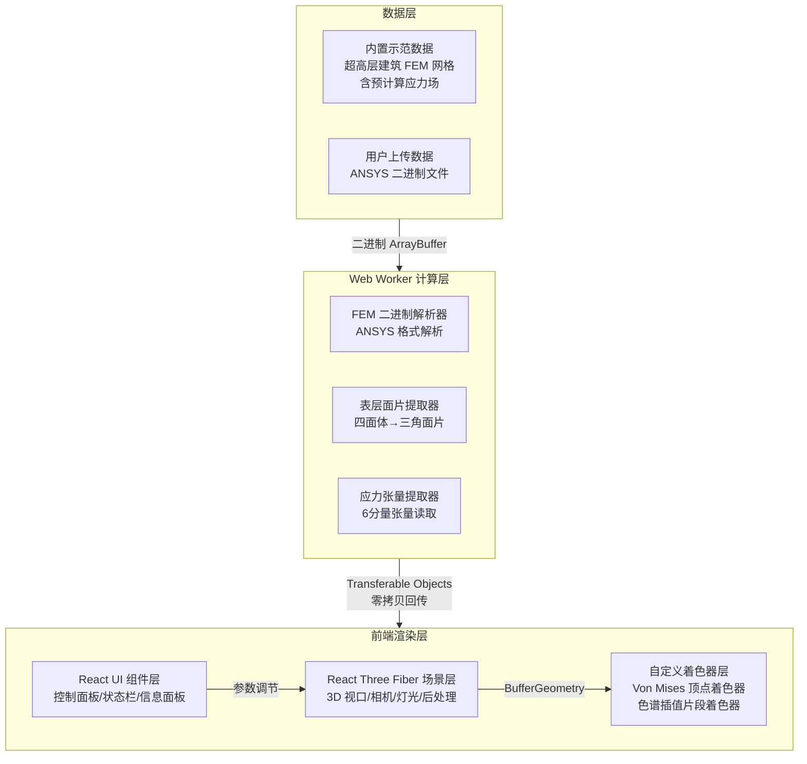
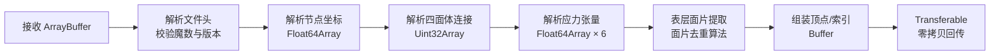
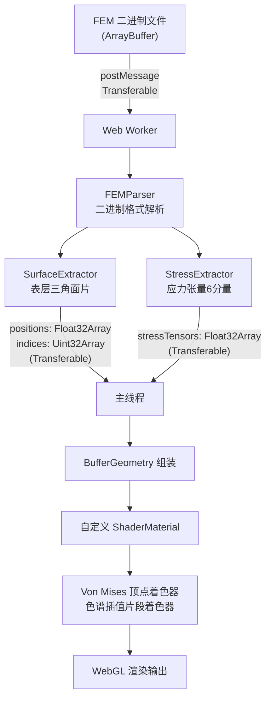

## 1. 架构设计



## 2. 技术说明

- **前端框架**：React 18 + TypeScript + Vite
- **3D 渲染**：Three.js + @react-three/fiber + @react-three/drei + @react-three/postprocessing
- **样式方案**：Tailwind CSS 3
- **状态管理**：Zustand
- **Web Worker**：Vite 内置 Worker 支持（`new Worker(new URL(...), { type: 'module' })`）
- **后端**：无（纯前端应用，所有计算在浏览器端完成）
- **数据库**：无（使用内置示范数据与用户上传文件）

## 3. 路由定义

| 路由 | 用途 |
|-----|------|
| `/` | 3D 可视化主页面，全屏场景+浮动控制面板 |

## 4. 核心技术架构

### 4.1 FEM 二进制文件格式设计（ANSYS 导出模拟格式）

```
[文件头 - 64 字节]
  magic:        char[8]     // "ANSYS_FEM"
  version:      uint32      // 版本号
  nodeCount:    uint32      // 节点总数
  elemCount:    uint32      // 四面体单元总数
  stressCount:  uint32      // 应力数据条目数
  reserved:     byte[40]    // 保留字段

[节点数据块]
  每节点 3 × float64 (x, y, z)

[单元连接关系块]
  每单元 4 × uint32 (n0, n1, n2, n3) — 四面体4个顶点索引

[应力数据块]
  每条目 6 × float64 (σxx, σyy, σzz, τxy, τyz, τxz)
```

### 4.2 Web Worker 解析流水线



### 4.3 表层面片提取算法

四面体有 4 个三角面片。若某面片仅被 1 个四面体引用则为外表面片，被 2 个四面体引用则为内部面片。通过面片排序去重提取表层暴露面片：

1. 遍历所有四面体，生成 4 个面片（每个面片存储为排序后的 3 个节点索引）
2. 对面片按排序后的索引进行计数
3. 仅出现 1 次的面片即为表层暴露面片
4. 收集表层面片的节点索引，重建顶点与索引缓冲

### 4.4 Von Mises 等效应力着色器

在顶点着色器中实时计算 Von Mises 等效应力：

```
σ_vm = √( σxx² + σyy² + σzz² - σxx·σyy - σyy·σzz - σzz·σxx + 3·(τxy² + τyz² + τxz²) )
```

色图映射：将 σ_vm 归一化到 [0, 1]，使用 5 段线性插值色图：
- 0.0 → 深蓝 (0.0, 0.0, 0.55)
- 0.25 → 青 (0.0, 0.81, 0.82)
- 0.5 → 绿 (0.0, 1.0, 0.5)
- 0.75 → 黄 (1.0, 0.84, 0.0)
- 1.0 → 亮红 (1.0, 0.0, 0.25)

### 4.5 数据流架构



## 5. 项目目录结构

```
src/
├── components/           # React UI 组件
│   ├── Scene.tsx         # 3D 场景容器
│   ├── ControlPanel.tsx  # 左侧控制面板
│   ├── InfoPanel.tsx     # 右侧信息面板
│   ├── StatusBar.tsx     # 顶部状态栏
│   ├── Timeline.tsx      # 底部时间轴
│   └── FileUploader.tsx  # 文件上传区
├── workers/              # Web Workers
│   └── femParser.worker.ts  # FEM 解析 Worker
├── shaders/              # GLSL 着色器
│   ├── stress.vert.glsl  # Von Mises 顶点着色器
│   └── stress.frag.glsl  # 色谱插值片段着色器
├── utils/                # 工具函数
│   ├── femGenerator.ts   # 示范 FEM 数据生成器
│   ├── surfaceExtractor.ts # 表层面片提取算法
│   └── geometryBuilder.ts  # BufferGeometry 构建器
├── store/                # Zustand 状态
│   └── useStore.ts       # 全局状态管理
├── pages/                # 页面
│   └── Home.tsx          # 主页面
├── App.tsx
└── main.tsx
```
